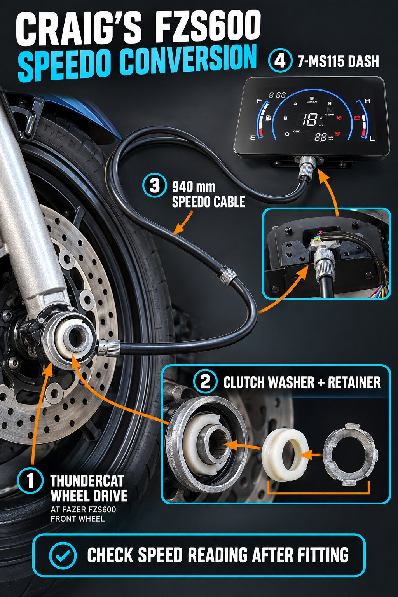
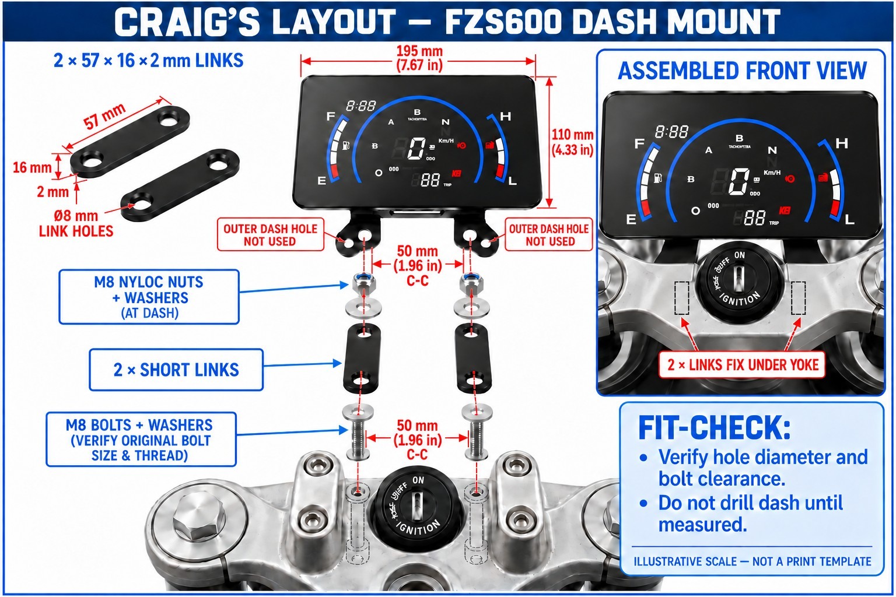
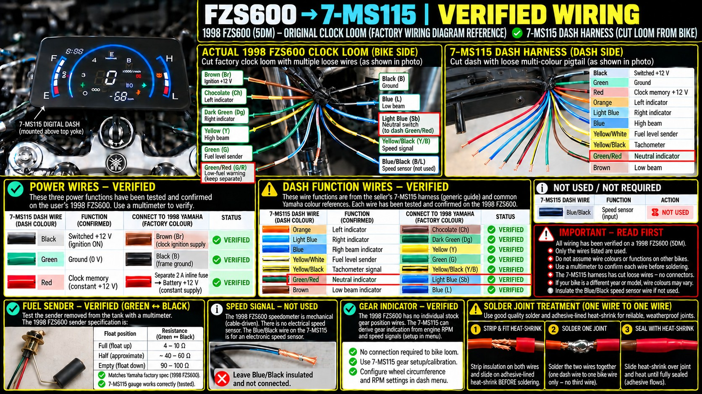
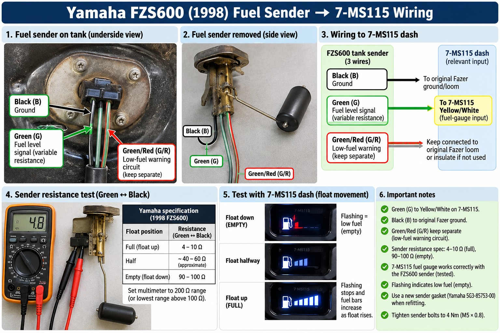
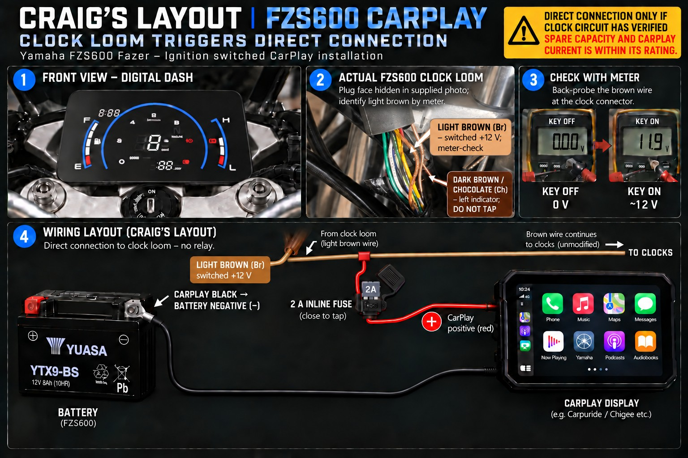

# Craig's Yamaha FZS600 Fazer — 7-MS115 Digital Dash & CarPlay GPS Conversion

Community build reference for the **1998 Yamaha FZS600 (5DM)**. Compatibility with other model years and aftermarket dashboard variants is **not confirmed**.

> **Safety and verification notice:** The accompanying Craig's Layout illustrations are reference concepts, not a fully validated wiring schematic. Some illustration captions say VERIFIED where no complete functional test has been documented. Follow the written corrections below, the Yamaha service manual, and the exact dashboard manufacturer's pinout. Do not solder connections based on colour alone.

## Uploaded project images

The five JPG reference images are the complete project gallery. They are displayed below under their uploaded filenames because their exact subject-to-filename mapping has not yet been verified. **Read the wiring corrections below before using any illustration.**

### Uploaded image 1

[Open original image](./518f039a-082b-4361-8693-e8038a6417d4.jpg)

### Uploaded image 2

[Open original image](./711b0af1-4c72-4dbf-8a79-2b19058c55ba.jpg)

### Uploaded image 3

[Open original image](./8d2a0504-304a-422c-afd4-f771d6becad7.jpg)

### Uploaded image 4

[Open original image](./d15a4c49-e674-4d37-960e-bc145fec4a95.jpg)

### Uploaded image 5

[Open original image](./d2dd8966-6cf6-4a4e-9733-20bc26df8ade.jpg)

## Wiring reference (1998 FZS600 to 7-MS115)

| 7-MS115 wire | Fazer connection | Purpose | Status |
|---|---|---|---|
| Black | Brown | Switched +12 V | Owner-reported; recheck |
| Green | Black | Ground | Owner-reported; recheck |
| Red | Separately fused +12 V | Memory power | Owner-reported; verify current and fuse |
| Orange | Chocolate | Left indicator | Proposed; test |
| Light Blue | Dark Green | Right indicator | Proposed; test |
| Blue | Yellow | High beam | Proposed; test |
| Yellow/White | Green | Fuel-level sender | **Functionally tested by owner** |
| Green/Red | Light Blue / Sky Blue (Sb) | Neutral switch | Candidate; confirm ground-triggered input |
| Brown | Black/Blue (B/L) | Low-beam indicator | Dash-side function owner-confirmed; verify bike-side signal |
| Yellow/Black | Undetermined | RPM input | **Do not connect until verified** |
| Speed input | Undetermined | Speedometer signal | **Do not connect until verified** |

### Critical corrections to the illustration

- **Fazer Green/Red is the original low-fuel warning circuit, not neutral.** Keep it separate from the dash Green/Red.
- **Fazer Light Blue / Sky Blue (Sb)** is the candidate neutral-switch wire. Verify continuity to ground in neutral and open circuit in gear before connecting to a confirmed ground-triggered dash neutral input.
- **7-MS115 Brown** is the owner's stated low-beam indicator input; **Fazer Black/Blue (B/L)** is the proposed matching circuit, **not plain Blue**.
- The 1998 FZS600 factory system includes an **electronic speed sensor**. An infographic saying it is exclusively mechanical or that speed input is unused is incorrect.
- The illustrated **940 mm Thundercat mechanical speedometer cable** has **not** been shown to interface with the electronic 7-MS115 dash. Mechanical fit and speed-signal compatibility must be established separately.
- Tachometer, gear indicator and all other untested dash wires remain provisional.

## Fuel sender: owner-tested behaviour

Fazer **Green** sender signal to 7-MS115 **Yellow/White** fuel input. Fazer **Black** remains ground; Fazer **Green/Red** is the separate low-fuel warning circuit. With the sender removed and float raised, the owner reported that fuel bars increased and the empty indication stopped flashing. This verifies the *directional gauge response*, not necessarily the full calibration. Treat illustrated resistance ranges as reference values pending independent confirmation for the exact sender.

## CarPlay power

The illustration depicts a direct tap from the Fazer switched Brown clock circuit through a 2 A inline fuse. **Do not copy without confirming the CarPlay's current draw, the existing circuit loading, and fuse/wire suitability.** Where capacity is uncertain, use a separate appropriately fused battery supply controlled by an ignition-switched relay and a sound ground return. The pictured 2 A fuse is not a universal recommendation.

## Dash mounting

Illustrated links are approximately 57 × 16 × 2 mm with proposed 8 mm holes; the image also shows 50 mm centre spacing. **Measure the actual dash and top yoke before drilling or ordering fasteners.** Hole size, thread, strength, clearances, steering travel and cable routing are not production-verified.

## Safety

Disconnect the battery before permanent splicing. Verify circuits with a multimeter and the correct manual. Protect joins against water, vibration, sharp edges and chafing. Keep electrical work away from petrol vapours. Check accurate speed display before road use.

## Contributing

Measured wiring pinouts, seller documentation for the exact 7-MS115, speed-sensor interface details and real-world fitment results are welcome as corrections. Please distinguish bench-tested, bike-tested and untested claims.

*Published as an owner project reference, not a factory-approved modification guide.*
